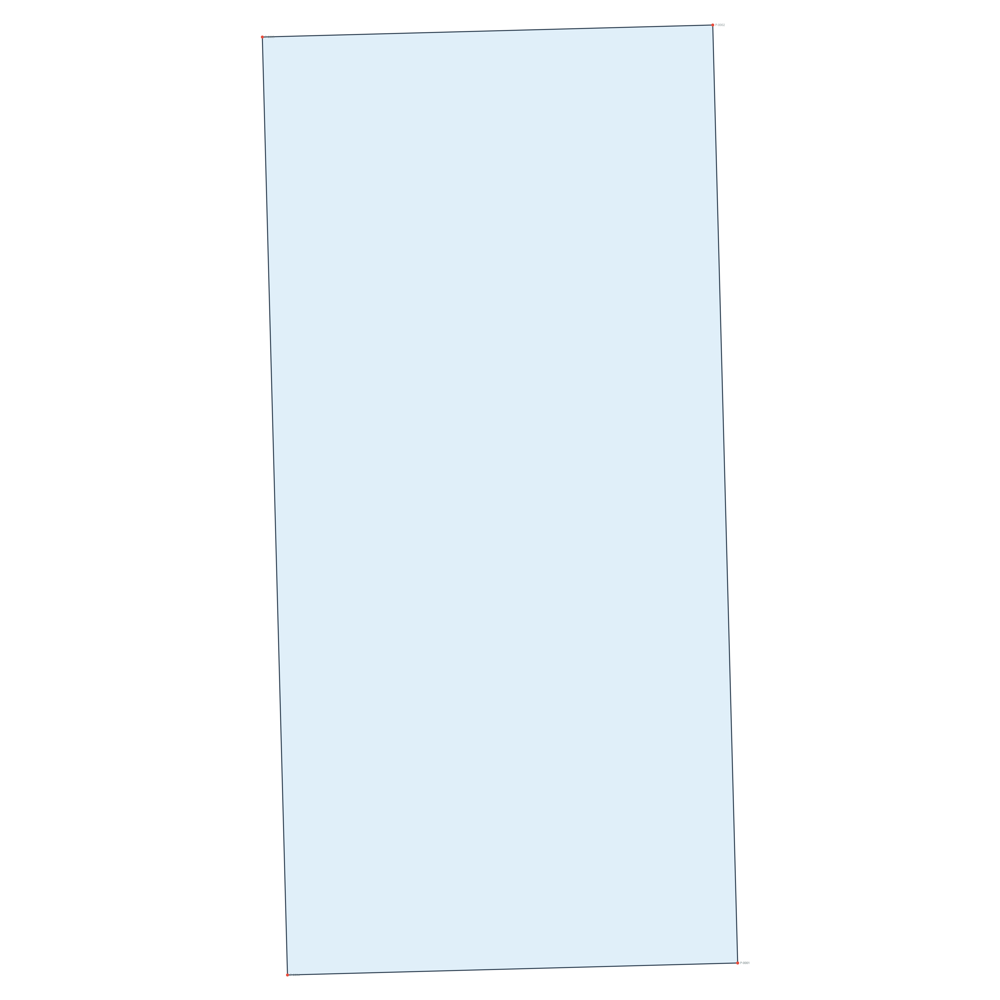
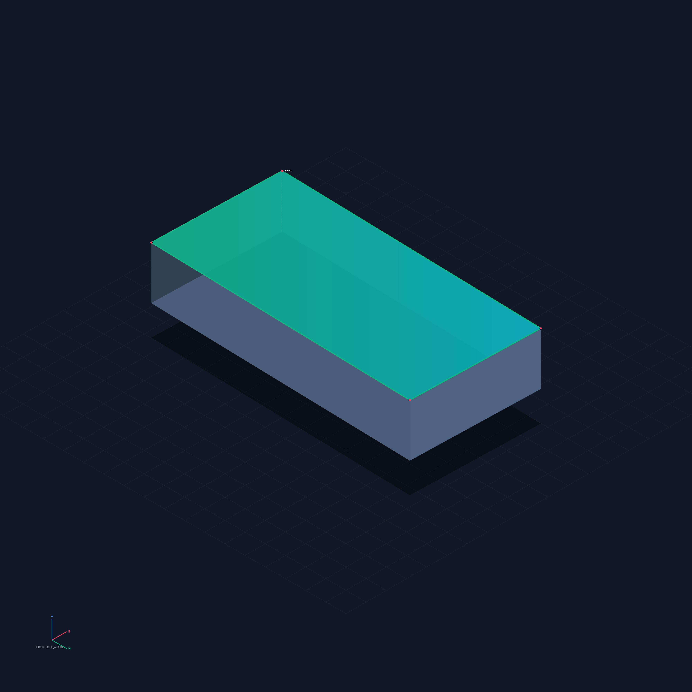

# pdf-to-maps — SIGEF/INCRA Geoprocessor (2D & 3D)

[](LICENSE)
[](package.json)
[](#)

A high-performance Node.js (ESM) library and pipeline developed by **Diego Oris** to extract, validate, geodetically project, and render high-resolution 2D maps and 3D isometric extruded territorial blocks directly from georeferenced land description PDFs (SIGEF/INCRA standard).

This geoprocessor is designed to run **100% offline and deterministically**. It relies on no external APIs, AI models, or cloud execution, ensuring absolute legal security over confidential real estate documents and proprietary land deeds.

---

## 📸 Output Map Visualizations

The following outputs are generated programmatically using pure cartographical mathematics from a raw digital land deed PDF:

### 📐 2D Scale-Aware Map with Coordinate Grids
Planar map projection computed with coordinate bounding offsets, custom scale-uniform fitting to preserve original geographic proportions, metric grid axes (UTM), and custom vertex node markers.


### ⛰️ 3D Isometric Map with Volumetric Extrusion and Solar Shading
Three-dimensional block projection computed via custom trigonometric rotation matrices, featuring diffuse side-wall shading based on the dot product of the wall normal and the artificial solar vector, with polished neon-style perimeter highlights.


---

## 🧮 Mathematical & Cartographic Formulations

Every calculation within the pipeline is driven by explicit mathematical models:

### 1. DMS (Degrees, Minutes, Seconds) to Decimal Degrees (DD)
The raw geographic coordinates extracted from the PDFs in sexagesimal notation (Degrees, Minutes, and Seconds - DMS) are normalized and translated into floating-point decimals:

$$DD = \text{sgn}(D) \cdot \left( |D| + \frac{M}{60} + \frac{S}{3600} \right)$$

Where:
- $D$: Integer degrees extracted.
- $M$: Integer minutes.
- $S$: Decimal seconds (floating-point precision).
- $\text{sgn}(D)$: Sign function. If the coordinate orientation indicates West (`W`/`O`) or South (`S`), or if an explicit minus sign is present, $\text{sgn}(D) = -1$, otherwise $+1$.

The regex parser cleans and normalizes various typographic layouts, seamlessly matching representations such as `-04° 44' 00.00"` or `04 44 00,00`.

### 2. Dynamic UTM Zone and Hemisphere Calculation
Projecting the geodetic points onto a planar metric grid requires determining the corresponding Universal Transverse Mercator (UTM) zone from the decimal longitude ($\lambda$):

$$\text{Zone} = \left\lfloor \frac{\lambda + 180}{6} \right\rfloor + 1$$

The hemisphere determines whether the vertical axis coordinates will be shifted to prevent negative vertical values (False Northing) in the Southern Hemisphere ($\phi < 0$):

$$\text{False Northing} = \begin{cases} 10,000,000\text{ m} & \text{se } \phi < 0 \\ 0\text{ m} & \text{se } \phi \geq 0 \end{cases}$$

The system performs precise geodetic to planar conversions using the **GRS80/SIRGAS2000** ellipsoid models (WGS84 parameters, the official legal cartographic standard in Brazil) via `proj4`.

### 3. Aspect-Ratio Uniform Scaling (2D Canvas)
To draw the geographic polygon onto a square computational canvas of dimensions $W \times H$ (e.g., $4000 \times 4000\text{ px}$) without warping or stretching the physical shape of the property, we resolve a uniform scaling factor $S$ using a boundary padding $P$:

$$S = \min\left( \frac{W - 2P}{X_{\max} - X_{\min}}, \frac{H - 2P}{Y_{\max} - Y_{\min}} \right)$$

The final screen pixel coordinates $(u, v)$ are translated and vertically flipped (since computer canvas coordinates locate $(0,0)$ at the top-left margin) as follows:

$$u = P + (X - X_{\min}) \cdot S + \frac{(W - 2P) - (X_{\max} - X_{\min}) \cdot S}{2}$$

$$v = P + (Y_{\max} - Y) \cdot S + \frac{(H - 2P) - (Y_{\max} - Y_{\min}) \cdot S}{2}$$

### 4. 3D Isometric Projection & Rotation
To construct the isometric volumetric geometry, we translate the metric UTM polygon into a local floating-point origin $[-1000, 1000]$ to eliminate floating-point coordinate precision loss. We then apply a three-dimensional spatial rotation of Yaw ($\theta = -45^\circ$) and Pitch ($\phi = 35.264^\circ$, where $\sin(\phi) = 1/\sqrt{3}$) to project the metrics onto the 2D plane:

1. **Trigonometric Yaw Rotation**:
   $$x_{\text{rot}} = x' \cdot \cos(-45^\circ) - y' \cdot \sin(-45^\circ) = \frac{\sqrt{2}}{2} \cdot (x' + y')$$
   $$y_{\text{rot}} = x' \cdot \sin(-45^\circ) + y' \cdot \cos(-45^\circ) = \frac{\sqrt{2}}{2} \cdot (-x' + y')$$

2. **Isometric Canvas Projection with Extrusion ($z$)**:
   $$u_{3D} = u_{\text{center}} + x_{\text{rot}} \cdot S_{3D}$$
   $$v_{3D} = v_{\text{center}} + y_{\text{rot}} \cdot \sin(35.264^\circ) \cdot S_{3D} - z$$

Where:
- $x', y'$ are the localized, translated UTM meters.
- $S_{3D}$ is the scale factor computed to fit the isometric bounding box on screen.
- $z$ is the physical coordinate extrusion offset (base of terrain $z = 0$ or top surface of terrain $z = 350\text{ px}$).

### 5. Diffuse Wall Shading via Vector Dot Products
To render volumetric depth along the lateral extruded walls of the geographical terrain block, we compute diffuse solar lighting incidence using vector math:

1. **Exterior Normal Vector ($\vec{N}$)** for a lateral segment spanning from vertex $i$ to $i+1$:
   $$\vec{N} = \left[ -\frac{Y_{i+1} - Y_i}{d}, \frac{X_{i+1} - X_i}{d} \right]^T$$
   Where $d = \sqrt{(X_{i+1} - X_i)^2 + (Y_{i+1} - Y_i)^2}$ is the distance in planar meters of the horizontal segment.

2. **Dot Product with Solar Vector ($\vec{L}$)**:
   We establish a constant solar direction vector coming from the top-left corner of the isometric viewport as $\vec{L} = [-0.707, 0.707]^T$. The diffuse lighting factor $k_d$ is resolved by:
   $$k_d = \vec{N} \cdot \vec{L} = N_x \cdot (-0.707) + N_y \cdot 0.707$$

3. **HSL Lightness Mapping**:
   We map the dot-product range $k_d \in [-1.0, 1.0]$ linearly to HSL lightness percentages between $35\%$ (full shadow) and $100\%$ (full solar exposure):
   $$\text{Luminosity} = 35\% + (k_d + 1.0) \cdot 32.5\%$$

---

## 📁 Repository Structure

```
pdf-to-maps/
├── assets/                      # Public demonstration map assets
├── create_example.js            # Script to generate a non-confidential sample PDF
├── index.js                     # Main package entrypoint / ESModules export
├── package.json                 # Project manifest and Diego Oris authorship details
├── package-lock.json            # NPM dependencies lockfile
├── .gitignore                   # Ignores confidential files, exempts sample PDF
├── LICENSE                      # Open-source MIT License
└── src/                         # Core codebase
    ├── index.js                 # Central orchestrator and parallel worker queue
    ├── parser/
    │   ├── pdfReader.js         # Layout-aware spatial PDF text reconstruction
    │   └── vertexExtractor.js   # Regex-based DMS coordinate filter & extractor
    ├── projection/
    │   └── utmProjector.js      # UTM cartographic coordinate projector (Proj4)
    ├── draw/
    │   ├── mapRenderer.js       # Bitmap 2D planar map rendering module (Canvas)
    │   └── mapRenderer3D.js     # Bitmap 3D isometric extruded map module (Canvas)
    ├── export/
    │   ├── geojsonExporter.js   # OGC GeoJSON feature collection exporter
    │   ├── dxfExporter.js       # CAD-ready AutoCAD DXF POLYLINE (R12) exporter
    │   ├── svgExporter.js       # Vector-based SVG map exporter
    │   └── logExporter.js       # Topographical Turf report logger (TXT)
    └── utils/
        └── helper.js            # DMS parsing and path helper functions
```

---

## 🔒 Confidential Data Protection

Real-world georeferenced deeds contain sensitive proprietary and personal ownership information subject to confidentiality agreements and privacy laws (such as GDPR / LGPD).

To eliminate any risk of accidentally staging or pushing confidential PDF documents to public GitHub repositories, [`.gitignore`](.gitignore) is pre-configured to strictly ignore all `.pdf` documents within the directory, while allowing an explicit exception rule for the public test file:

```gitignore
# PDFs of land deeds/contracts (confidential)
*.pdf
!exemplo_sigef.pdf
```

You can batch process thousands of proprietary documents locally with peace of mind: only the non-confidential file `exemplo_sigef.pdf` will ever be committed.

---

## 🛠️ Installation & Setup

### Prerequisites
- **Node.js** v18 or higher.

### Installing Dependencies
Open a shell terminal in the project directory and execute:
```bash
npm install
```

The underlying libraries used for the pipeline are:
- `canvas`: Native C++ node-canvas integration for rapid server-side image processing.
- `@turf/turf`: Geodetic spatial mathematics engine for geodesic surface properties.
- `pdfjs-dist`: High-fidelity vector layout document parser.
- `proj4`: Coordinate system conversion and cartographic projections engine.
- `pdf-lib`: Native PDF document creation utility.

---

## 🚀 Execution Guide

### Step 1: Create the Public Sample PDF
Generate a mock georeferenced land deed called `exemplo_sigef.pdf` containing a 4-vertex polygon situated in northern Brazil (Amazonas) without exposing proprietary data:
```bash
node create_example.js
```

### Step 2: Execute the Main Processor
Scan and geoprocess every land deed PDF present in the directory:
```bash
node index.js
```

To process files from a custom external directory, pass it as an argument:
```bash
node index.js /path/to/your/pdf/folder
```

### Step 3: View Outputs
A corresponding sub-directory will be generated instantly for each PDF inside `./output/[PDF_NAME]/`:
- **`vertices.json`**: Structured array of geodetic and projected coordinate records.
- **`mapa.png`**: High-resolution 2D map bitmap ($4000 \times 4000\text{ px}$).
- **`mapa_3d.png`**: Volumetric isometric 3D block model.
- **`mapa.svg`**: Highly-scalable vector graphic.
- **`mapa.geojson`**: Standard GIS FeatureCollection suitable for QGIS, ArcGIS, or Leaflet.
- **`mapa.dxf`**: 1:1 metric scale industrial CAD polyline file for surveyors.
- **`log.txt`**: Topographical log containing geodesic area (hectares, $m^2$) and boundary parameters computed via Turf.js.

---

## 💻 Programmatic API Integration

For custom software integrations, you can import individual modules programmatically into any ESModule JavaScript file:

```javascript
import { readPDFAndReconstructLines } from "./src/parser/pdfReader.js";
import { extractVerticesFromReconstructedLines } from "./src/parser/vertexExtractor.js";
import { projectVerticesToUTM } from "./src/projection/utmProjector.js";
import { validateAndClosePolygon } from "./src/index.js";

async function runCustomExtraction(pdfPath) {
    // 1. Spatial text sorting and line extraction
    const lines = await readPDFAndReconstructLines(pdfPath);
    
    // 2. Vertex parsing via strict decimal & DMS regex
    const rawVertices = extractVerticesFromReconstructedLines(lines);
    
    // 3. Topology validation & ring-closure
    const validVertices = validateAndClosePolygon(rawVertices);
    
    // 4. Proj4 translation to UTM SIRGAS2000 metric coordinates
    const { projectedVertices, zone, isSouth } = projectVerticesToUTM(validVertices);
    
    console.log(`Georeferenced Vertices projected onto UTM Zone ${zone}${isSouth ? "S" : "N"}:`, projectedVertices);
}
```

---

## 📄 License & Intellectual Property

This project is open-source and released under the terms of the **MIT License**.

Developed in its entirety by **Diego Oris**. All rights reserved. Feel free to integrate into commercial tools, customize, and build upon!
